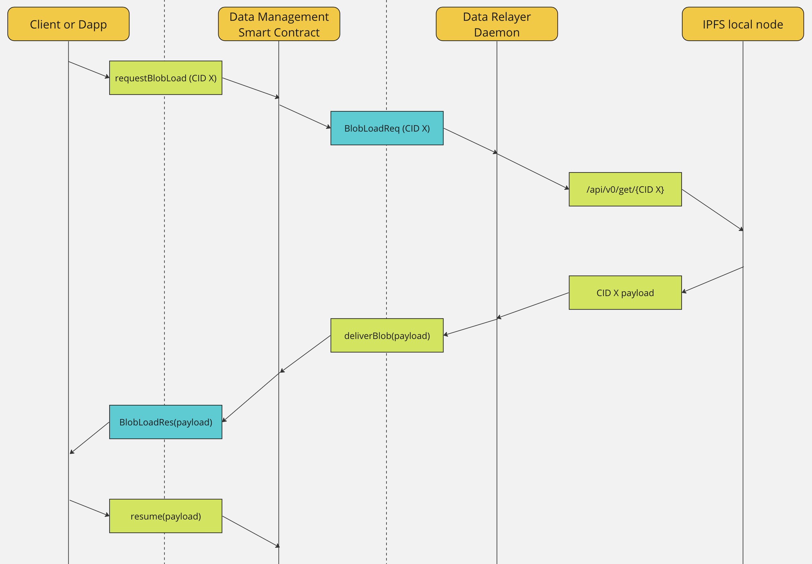

# State/Storage Integration PoC

Before diving into coding, it is essential to take a few minutes to understand the concept and design behind this Proof of Concept (PoC) by reviewing the provided [specification](https://www.notion.so/State-Storage-Integration-with-Filecoin-Virtual-Machine-IPFS-263f8e13509a44ce8b2e627fe0391a9e).

**Key Components**:

- **Client application/smart contract**

  - sends the request to the Data Management Contract (DMC) to retrieve content from IPFS for consumption.
  - continue any process in the smart contract once the content is served to DMC by relayer.

- **Data Management Contract (DMC)**

  The main functions of DMC include:

  - taking retrieval requests from client/application
  - temporarily storing data severed by Relayer from IPFS
  - serving data back to the client/application to continue their process

- **Relayer**: 

  listen to the event logs emitted from the Data Management Contract. If there is an IPFS content request event log - `BlobLoadReq`, the relayer will retrieve content from IPFS and send it to the Data management Contract. 



This repository contains the DMC, minimal functions of the client/application, and relayer. Its purpose is to demonstrate the end-to-end workflow of this Proof of Concept (PoC). 

You are welcome to enhance this PoC by adding more features and building products that consume the IPFS data served in the smart contract.

## Project Structure

The repository is organized as follows:

- `contracts/`: This directory contains the Data Management Contract (DMC).

- `scripts/`: This directory houses scripts used for deploying the DMC smart contract and scripts to simulate the functions of the client and relayer.
  - `dmc/`: the scripts to deploy DMC on Filecoin.

  - `client/`: the scripts to simulate the function from client/application, including sendDataRetrieve Request, check the status of the retrieve request, and continue the data process after receiving data on IPFS.

  - `relayer.js`: simulate the minimal function of a relayer to listen to the event, retrieve content from IPFS and send the data to the DMC.

- `test/`: This directory contains test files for the contracts. 

## Getting Started
> **Note:**
> Before getting started, we will need a local IPFS node to serve content. Make sure you install an [IPFS Desktop App](https://docs.ipfs.tech/install/ipfs-desktop/) on your local computer.
>
> You can also retrieve data through a [public IPFS gateway](https://docs.ipfs.tech/quickstart/retrieve/#fetching-the-cid-with-an-ipfs-gateway) using any generic HTTP request client.

To get started with the project, follow these steps:

1. Clone the repository

   ```shell
   git clone https://github.com/filecoin-project/state-storage-starter-kit.git
   ```

2. Install the project dependencies

   ```shell
   cd state-storage-starter-kit
   npm install
   ```
   Create a `.env` file in the project so you can add your wallet key and contract address in there for this project to use.  Make sure you have enough tFIL in your wallet for testing.
   ```shell
   PRIVATE_KEY=<your-wallet-key>
   ```

3. Deploy the Data Management Contract

   Let's deploy the data management contract to the Filecoin calibration network.

   ```
   npx hardhat run scripts/dmc/deploy.js --network calibration
   ```
   Copy & paste the smart contract address and add it to your `.env` file. 
   ```
   DMC_ADDR=<your-dataManagementContract-address>
   ```

4. Run the relayer daemon 

   The relayer will listen to the `BlobLoadReq` event emitted from the DMC. 

   ```
   npx hardhat run scripts/relayer.js
   ```

5. Simulate the client to send a request to load an NFT metadata JSON file from IPFS.

   > **Note:**
   > In this PoC, we only consider processing the request to retrieve small data (under 256 kb) from IPFS, such as a metaData.json or text file.

   You need to add your CID in the `scripts/client/sendRequest.js` . 

   ```
   const cid = '<replace the CID you want to retreive from IPFS>';
   ```

   Then run the `scripts/client/sendRequest.js` to send the request to the Data Management Contract. Once the transaction is executed on chain, a `LoadBlobReq` event will be emitted carrying the following args:
   - **correlationId**:can be used to check the request status in the smart contract.
   - **cidHex**： CID in hexString format.
   - reward
   - timeout

   ```shell
   npx hardhat run scripts/client/sendRequest.js
   ```
   The expected output looks like this:
   ```
   0xb1ed3d8944953e9217d4f22d80ce5400e1727e7b62662010bd63fb193f0c3c32
   requestBlobLoad transaction is confirmed on Chain.
   Event args 4,0x00015512204aac179adc23fded7923cd9d06b2057637d03fe2da9d2fbcd5a7eb59473f6b48,1000000000000000000,1000000000000000000
   ```

6. Relayer will capture the `LoadBlobReq` event and process the request

   Once there is a `BlobLoadReq` emitted, the relayer will 

   - read the CID in the log 
   - fetch the content from a IPFS node
   - send the data to DMC for this request 

7. Once the data process is finished, the client can check the status of their request.

   In step-5, there is a `correlationId` being emitted and it represents your request in the smart contract. So we can use it to check the status of the client's request. 
   In `script/client/checkRequestStatus.js `, add the `correlationId` from step-5 and run the script to check the status of your request.

   ```shell
   npx hardhat run scripts/client/checkRequestStatus.js
   ```
   The expected output looks like this:
   ```
   Request status:  1
   Requested CID:  bafkreickvqlzvxbd7xwxsi6ntudleblwg7id7yw2tux3zvnh5nmuop3lja
   ```

8. After the client's data is served in the smart contract, the client can call the `retrieve` function to acquire data inside the smart contract to process.

   In the `retrieve` function, data can be returned or be re-sent to another smart contract to process using `delegateCall`.  It's up to builders to build more logic here to handle their own unique use case.


## Contributing

Contributions to the project are welcome! If you find any issues, have suggestions for improvements, or would like to add new features, please feel free to open an issue or submit a pull request. Make sure to follow the established coding conventions and provide clear descriptions for your contributions.

## License

The project is available under the [MIT License](LICENSE). Feel free to use, modify, and distribute the code as per the terms of the license.
